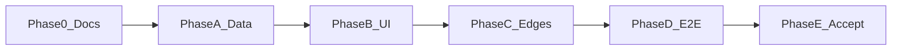

# 计划 — `<FEATURE_TITLE>`

行为 SoT：[methodology.md](./methodology.md) · 验收：[acceptance.md](./acceptance.md) · 定版：[demo](./demo-<feature-id>.html)

## Phase 0 — 文档

**交付**：本目录齐套 + demo；features README 收录。  
**退出**：acceptance §0；Phase 0 headed 探测已引用。

## Phase A — 数据接线

**交付**：合同字段到达可见面所用 store / props。  
**退出**：mock 带该字段时，DOM 能读到（样式可仍旧）。

## Phase B — 可见面

**交付**：只改作用域内组件；testid 齐；对照 demo 建议态。  
**禁止**：改冻结的完成后组件。

## Phase C — 边界

**交付**：空态、去重/真状态、停止或相邻合同不回归。

## Phase D — E2E

**交付**：`test/e2e/<feature-id>.spec.ts` S1 进行中 / S2 完成后+跨边界 / S3 回归。

## Phase E — 验收

**交付**：acceptance 勾选。

## 非目标（本期）

-  
